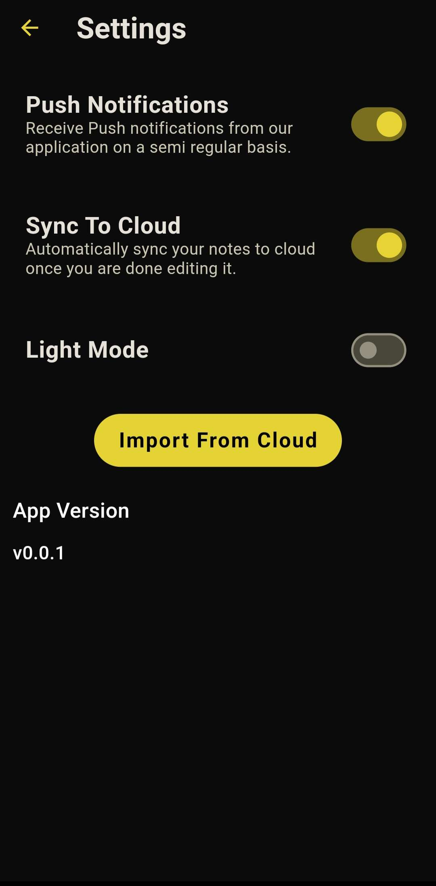

# Kanjou

## Description
Kanjou is a note-taking mobile application created with Flutter. It provides local storage for notes using an SQLite database and offers cloud storage through Firebase. 
Additionally, notes are categorized by a Flask server that leverages AI to select the most appropriate category.

## Screenshot Examples

  
  
  

